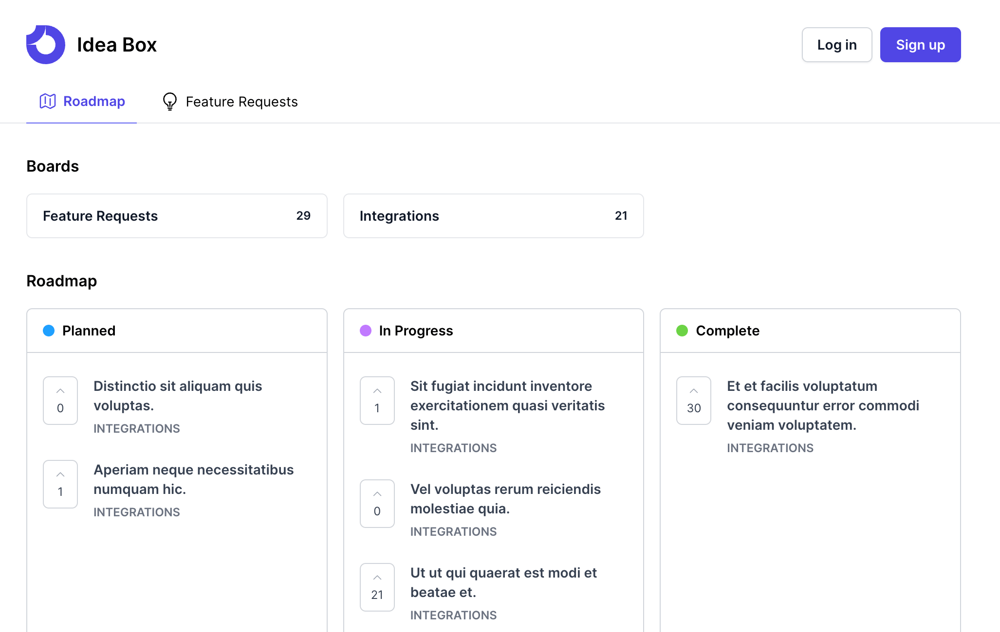

# IdeaBox

Welcome to **IdeaBox**, an open-source customer feedback and roadmap management tool.



This application is designed to help businesses gather, organize, and prioritize customer feedback to streamline their product development and roadmap planning. Built with Laravel, Inertia, React, and Tailwind, IdeaBox offers a robust and user-friendly platform for managing customer insights.

## Features

- **Feedback Collection**: Easy-to-use interface for collecting customer feedback.
- **Roadmap Management**: Visualize and plan your product roadmap based on customer insights.
- **Prioritization Tools**: Prioritize feedback to focus on what matters most to your customers.

## Getting Started

### Prerequisites

Ensure you have the following installed:

- PHP
- Composer
- Node.js
- Yarn

### Installation

1. **Clone the Repository**

   ```bash
   git clone https://github.com/your-username/IdeaBox.git
   cd IdeaBox
   ```

2. **Install PHP Dependencies**

   ```bash
   composer install
   ```

3. **Set Up Environment Variables**

   - Copy `.env.example` to `.env` and configure your environment variables.
   - Generate an application key.
     ```bash
     php artisan key:generate
     ```
     To set the application logo, add a square image as logo in the environment:

   ```bash
   APP_LOGO='https://path/to/logo.svg'
   ```

4. **Run Database Migrations**

   ```bash
   php artisan migrate
   php artisan db:seed
   ```

   A user has been created with the following credentials:

   ```
    Email: admin@example.com
    Password: password
   ```

5. **Install JavaScript Dependencies**

   ```bash
   yarn
   ```

6. **Build Assets**
   ```bash
   yarn build
   ```

### Usage

Start the local development server:

```bash
php artisan serve
```

Navigate to http://localhost:8000 in your web browser to view the application.

## Docker Deployment

This repository includes a production-focused Docker setup built around `docker compose`.

1. Copy the Docker env template and fill in your production values:

   ```bash
   cp .env.docker.example .env
   ```

2. Generate a stable application key and place it in `APP_KEY` inside `.env`:

   ```bash
   docker run --rm php:8.3-cli php -r "echo 'base64:'.base64_encode(random_bytes(32)).PHP_EOL;"
   ```

3. Set `APP_URL` to the public HTTPS URL you will deploy behind. This is required for correct GitHub OAuth callbacks and webhook URLs.

4. Build and start the deployment stack:

   ```bash
   docker compose up -d --build
   ```

5. Optionally seed the first deployment:

   ```bash
   docker compose exec app php artisan db:seed --force
   ```

6. Open the application at `http://localhost:8080` locally, or at your deployed domain. Container health is exposed at `/up`.

### Updating a Deployment

Future updates follow the same rebuild-and-redeploy flow:

```bash
git pull
docker compose up -d --build
```

The app container automatically waits for MySQL, runs `php artisan migrate --force`, ensures `public/storage` is linked, and warms Laravel's config and view caches on startup.

### Contributing

Contributions are what make the open-source community such an amazing place to learn, inspire, and create. Any contributions you make are greatly appreciated.

1. Fork the Project
1. Create your Feature Branch (`git checkout -b feature/amazing-feature`)
1. Commit your Changes (`git commit -m 'Add some Amazing Feature'`)
1. Push to the Branch (`git push origin feature/amazing-feature`)
1. Open a Pull Request

### License

Distributed under the MIT License. See **LICENSE** for more information.
